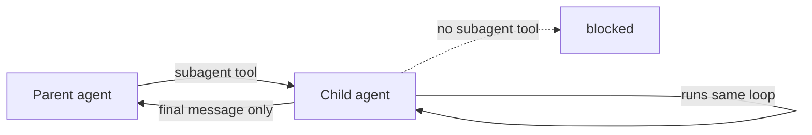

I have been using Claude Code for months, but I wanted to understand what was actually happening underneath.

Not the marketing version. Not a big architecture diagram. Just the basic question:

How does an AI coding tool read files, run commands, call tools, and keep going until it has an answer?

So I built a tiny educational version:

[claude-code-in-100-lines](https://github.com/adityasasidhar/claude-code-in-100-lines)

It is not Claude Code. It is not trying to replace Claude Code. It is a small Python project that shows the core idea behind tools like Claude Code, Cursor, and other coding agents.

The point is learning.

## What is an agent harness?

An LLM by itself is just a model that takes text in and gives text back.

A coding agent needs more than that. It needs a small program around the model that can:

- send the user's message to the model
- show the model which tools are available
- run a tool when the model asks for one
- give the tool result back to the model
- repeat until the model gives a final answer

That small program is the harness.

The surprising part is that the core harness is not very complicated.

## The main loop


This is the basic loop:

1. You type a request.
2. The harness sends that request to the model.
3. The model either answers, or asks to use a tool.
4. If it asks for a tool, the harness runs that tool.
5. The harness sends the tool result back to the model.
6. This continues until the model gives a normal text answer.

That is the important idea.

The model does not literally run `ls`, open files, or sleep for 10 seconds. The model only asks for those things. The Python harness is the part that actually does them.

In the repo, this loop lives in `src/llm.py`.

## Tools are just functions

In this project, the agent has three tools:

- `bash`: run a shell command
- `timer`: wait for a number of seconds
- `subagent`: hand a smaller task to a fresh agent

They live in `src/tools.py`.

Here is the simple way to think about tools:

The model says, "I want to call `bash` with this command."

The harness says, "Okay, I know what `bash` is. I will run that Python function and give you the output."

For example:

```text
You> what files are in the current directory?
  ↳ bash({'command': 'ls'}) -> LICENSE  README.md  src
LLM> The current directory contains LICENSE, README.md, and src/.
```

The line with the arrow is printed by the harness. It lets you see the hidden machinery.

That visibility is useful because most polished coding tools hide this from you. You only see the final answer, not the steps.

## The "smart" part is not the loop

The loop is simple. The useful behavior comes from a few other things:

- a capable model
- a system prompt that explains how the agent should behave
- useful tools
- enough conversation history for the model to know what already happened
- instructions that can be loaded only when needed

This is why I think building a tiny version is useful. It makes the framework feel less magical.

You can point at the pieces and say:

- this part stores messages
- this part calls the model
- this part runs tools
- this part prints tool calls
- this part stops the loop if it runs too long

## Skills are instructions the agent reads only when needed

Real coding agents need lots of instructions.

For example:

- how to review code
- how to write a commit message
- how to debug a failing test
- how to build a frontend

One bad way to do this is to paste every instruction into the prompt every time.

That wastes space.

LLMs have a limited context window. You can think of the context window as the model's working memory. If you stuff it with instructions that are not relevant, there is less room for the actual task.

This repo uses a simpler trick.

At startup, it gives the model a short index of available skills. Each skill has a short description and a file path. If the model needs the full instruction, it can read the file with `bash`.

That idea is called progressive disclosure.

Plain English version:

Show the model a menu first. Let it open the full recipe only if it needs it.

In the repo, this is handled by `src/loader.py`.

## Memory works the same way

The repo also has a tiny memory system in `src/memory.py`.

Memory does not mean the model magically remembers everything forever.

Instead, the harness creates a `.agent/` folder in the project you are working in. That folder can contain notes the agent may read later.

Again, it does not load every memory into the prompt by default. It gives the model the path to a memory index. If the model thinks memory might matter, it can read the index and then read the specific memory file it needs.

Same pattern:

Do not load everything. Load only what matters.

## Subagents are recursion with a leash



A subagent sounds fancy, but the idea is simple.

The main agent can say:

"This is a separate task. Start a fresh agent, give it only this task, and bring back the final answer."

That fresh agent has its own empty conversation history. It does not see the parent's whole conversation. That is useful when the task is noisy, like searching through many files or running a long investigation.

When the subagent finishes, it returns one final message to the parent.

The important safety rule in this repo is that subagents cannot create more subagents. A child agent gets the normal tools, but not the `subagent` tool.

That prevents an infinite tree of agents spawning more agents.

## Why this is useful to study

The project is intentionally small. That is the point.

When you read it, you can see that a coding agent is mostly:

- a message history
- a system prompt
- a list of tools
- a loop that calls the model
- tool results being fed back into the model

Once you understand that, bigger tools become easier to reason about.

When an agent does something weird, you can ask better questions:

- Did the prompt give bad instructions?
- Did the model choose the wrong tool?
- Did the tool return confusing output?
- Did the context get too large?
- Did the agent need a more specific skill?
- Should this have been isolated in a subagent?

That is the real value of the repo. It gives you a small version you can hold in your head.

## Where to start

If you open the code, read it in this order:

1. `src/llm.py` - the main model/tool loop
2. `src/tools.py` - the tools the model can ask for
3. `src/main.py` - how the REPL starts the agent
4. `src/loader.py` - how skills are indexed
5. `src/memory.py` - how project memory is created

Start with `src/llm.py`. That is where the core idea becomes obvious.

The code is [on GitHub](https://github.com/adityasasidhar/claude-code-in-100-lines).

---

*Not affiliated with Anthropic. This is a small educational reimplementation of the basic agent harness idea. It runs locally through Ollama and does not call the Anthropic API.*
