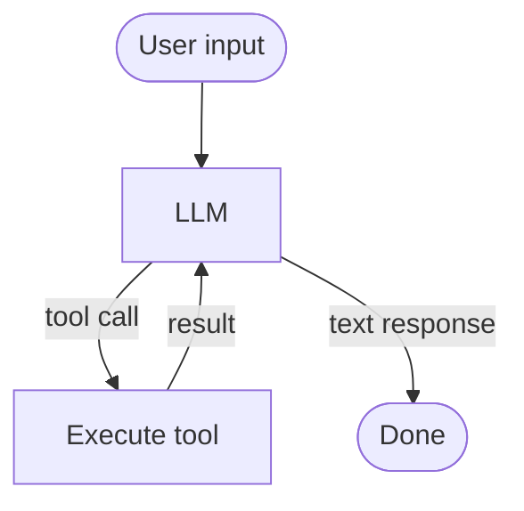
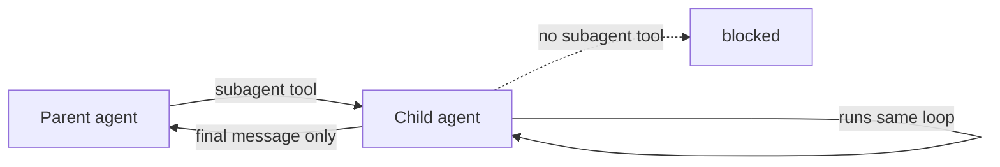

I've been using Claude Code for months. But I had a nagging feeling I didn't really understand *how* it worked. Not the architecture docs — the actual loop. So I built one from scratch.

[claude-code-in-100-lines](https://github.com/adityasasidhar/claude-code-in-100-lines) is a minimal agent harness in ~110 lines of Python that reimplements the core ideas, running entirely locally via Ollama.

## The loop is simpler than you think

Every agent framework is, at its core, a while loop:



That's it. The apparent intelligence of a coding agent comes from a good system prompt, well-designed tools, and a capable model. The harness is mechanical. Knowing this changes how you think about agents — the "magic" is never in the framework.

## Tool schemas should write themselves

Most frameworks make you maintain implementations *and* JSON schemas in parallel — they drift constantly. The fix: derive schemas from function signatures and docstrings automatically. Adding a tool becomes just writing a function.

## Progressive disclosure keeps context lean

A coding agent needs playbooks for commits, code review, debugging. Loading all of them on every turn is wasteful. The solution: inject a one-line index at startup. The agent reads a playbook in full only when a task matches, paying zero tokens otherwise. Memory works the same way.

## Subagents are recursion with a leash



A subagent is just another `LLM` instance with an empty history, handed a fresh task. The parent calls it, waits for a single return value, and the child disappears. Children can't spawn children — this bounds recursion and keeps failures debuggable.

The power is scoping: noisy exploration (a wide search, a long build) runs in isolation and returns only its conclusion. The parent's context stays clean.

## What the transparency teaches you

Every tool call prints as it executes:

```
You> what files are in the current directory?
  ↳ bash({'command': 'ls'}) -> LICENSE  README.md  src
LLM> The current directory contains: LICENSE, README.md, and src/.
```

After a few minutes you develop intuitions about *why* the model makes the choices it does. Polished tools deliberately hide this. A transparent harness makes the reasoning legible — and that's the whole point of building one.

---

The code is [on GitHub](https://github.com/adityasasidhar/claude-code-in-100-lines). Read `llm.py` first.

*Not affiliated with Anthropic. Runs on whatever model you point Ollama at — no Anthropic API calls.*
