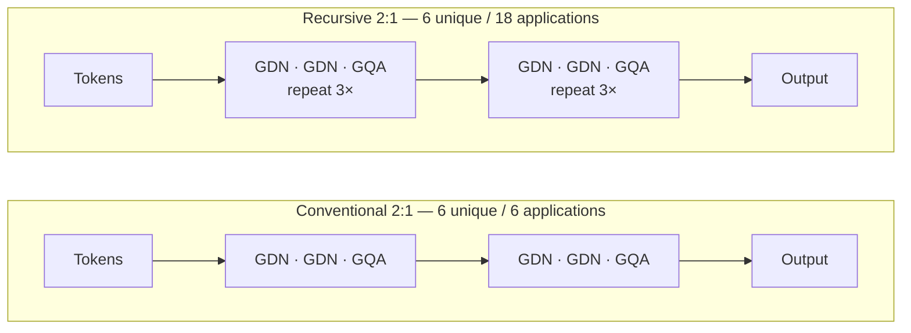
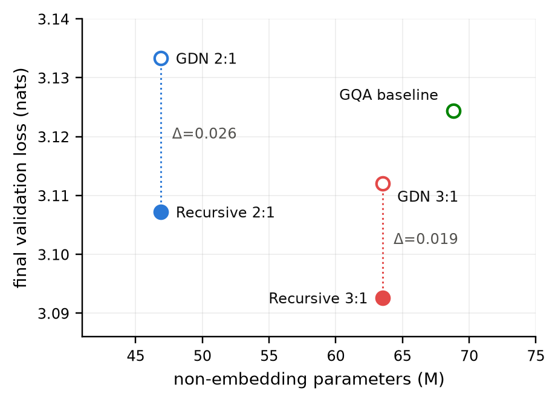
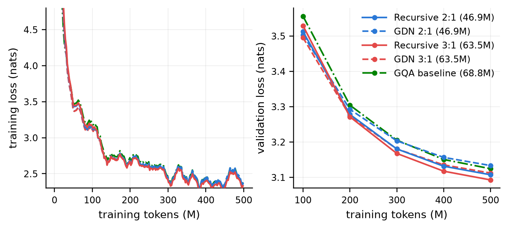
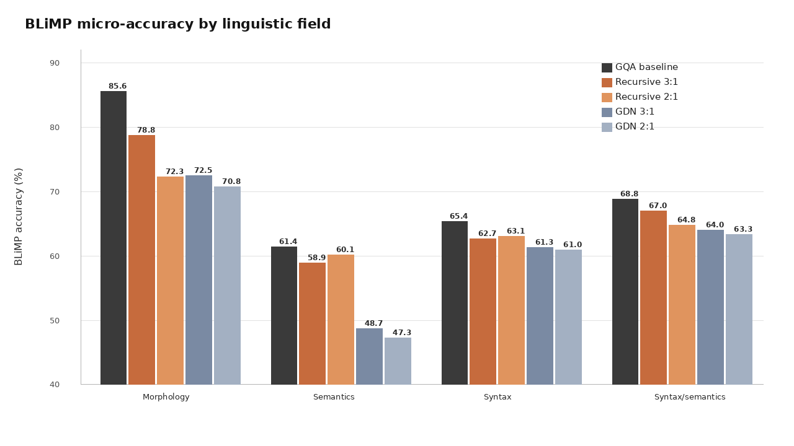
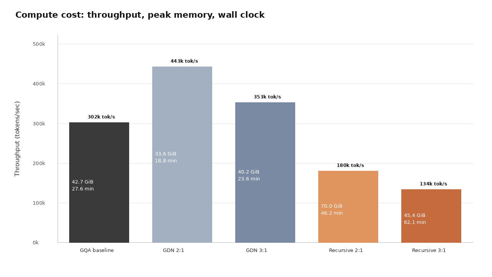

At 100 million training tokens, my experiment looked like a failure.

The two models that reused their layers were worse than the models that simply moved through each layer once. If I had stopped the runs there, my conclusion would have been easy: recursion adds compute and makes small language models harder to train.

Then, somewhere before 200 million tokens, both comparisons flipped.

The recursive models moved ahead of their conventional twins and stayed ahead for the rest of training. By the final checkpoint, they had the two lowest validation losses in the experiment—even beating a larger model made entirely from standard attention layers.

That result comes with several asterisks. It does not mean recursion is free, universally better, or even the sole cause of the improvement. But it does answer a useful, tightly controlled question:

> If two small language models have the same number of learned parameters, can one do better by applying its layers more than once?

For this experiment, the answer was yes.

## Why I asked this question

The [BabyLM challenge](https://babylm.github.io/) asks researchers to train language models with roughly the amount of text a human encounters during development. The 2026 Strict corpus contains about 100 million unique words—a rounding error next to the trillions of tokens used for frontier models.

That constraint makes BabyLM a good place to study architecture. When the data budget is fixed, a model cannot hide a weak design behind another trillion tokens.

I was interested in **depth recursion**, or running the same block of layers repeatedly with tied weights. A normal transformer gets deeper by adding new layers, each with its own parameters. A recursive transformer can get more *effective* depth by looping through layers it already owns.

The trade-off is straightforward:

- More independent layers spend more parameters.
- Reusing layers saves parameters, but spends more computation per token.

I wanted to know whether that trade could make sense for small models trained from scratch—not for a large model that had already learned useful representations.

## The experiment in one picture

The models were hybrids of two kinds of token-mixing layer:

- **Gated DeltaNet (GDN)**, a linear-attention layer with a compact recurrent state
- **Grouped-query attention (GQA)**, a conventional softmax-attention layer

I tested two recipes: two GDN layers for each GQA layer, written **2:1**, and three GDN layers for each GQA layer, written **3:1**.

The conventional 2:1 model stacks the recipe twice. It owns six layers and applies each one once. Its recursive twin owns the same six-layer inventory, divides it into two independent super-blocks, and applies each super-block three times.

In other words, the recursive 2:1 model has the parameters of six layers but performs 18 layer applications. The 3:1 version has eight unique layers and an effective depth of 24.

Here are the two controlled comparisons:

| Pair | Model | Unique layers | Effective depth | Non-embedding parameters |
|---|---|---:|---:|---:|
| A | GDN 2:1 | 6 | 6 | 46,913,888 |
| A | Recursive 2:1 | 6 | 18 | 46,913,888 |
| B | GDN 3:1 | 8 | 8 | 63,487,504 |
| B | Recursive 3:1 | 8 | 24 | 63,487,504 |

Within each pair, the models have the same number and shapes of learned parameter tensors, the same layer types, and the same feed-forward width. The recursive model changes how often its super-blocks run; it does not get extra weights.

I also trained a pure-GQA baseline with 68.8 million non-embedding parameters. It provides useful context, but it is not a matched comparison: its architecture and parameter count are different.

## Keeping everything else still

All five models used the same tokenizer, data order, optimizer, learning-rate schedule, sequence length, and training budget. Each run saw 499,908,608 tokens, or about 295 million words of exposure. Because the corpus contains about 100 million unique words, that is just under three passes through the data.

Every optimizer step contained 131,072 tokens, and every model saw the same tokens in the same order. I trained each configuration once with seed 42 on a single H100 80 GB GPU.

The recursive models also used residual initialization scaled to their effective depth. That matters: this experiment tests the complete recursive configuration—tied repetition plus depth-aware residual scaling—not weight tying in isolation.

## The result

Lower validation loss means a model assigns more probability to the held-out text. At the end of training, both recursive models beat their parameter-matched twins:

| Model | Non-emb. params | Effective depth | Validation loss ↓ | BLiMP ↑ |
|---|---:|---:|---:|---:|
| **Recursive 3:1** | 63.5M | 24 | **3.0926** | 67.48 |
| **Recursive 2:1** | 46.9M | 18 | **3.1072** | 65.56 |
| GDN 3:1 | 63.5M | 8 | 3.1121 | 63.27 |
| GQA baseline | 68.8M | 10 | 3.1244 | **71.07** |
| GDN 2:1 | 46.9M | 6 | 3.1333 | 62.24 |

Recursion lowered validation loss by **0.0261 nats** in the 2:1 pair and **0.0195 nats** in the 3:1 pair. The advantage was not coming from a handful of unusual examples: the recursive models won on 480 of 488 aligned validation windows in the 2:1 comparison and 462 of 488 in the 3:1 comparison.

Both recursive models also beat the larger pure-attention baseline on validation loss. That is interesting, but it is not causal evidence that recursion is better than attention. The baseline differs in parameter count, layer type, and attention density. The matched pairs are the part of the experiment I trust as a clean comparison.

## The most interesting part happened late

The final table hides the part of the experiment that surprised me most.

At the 100-million-token checkpoint, both recursive models were losing. At 200 million, both were winning. Their advantage then grew through the remaining checkpoints.

One pass through the tokenized corpus is about 170 million tokens, so the crossover happened inside an awkward interval: it may have occurred before the models began seeing repeated examples, or after. I saved checkpoints every 100 million tokens, which is too coarse to tell.

That leaves at least three possible explanations. The recursive models may need more optimization steps to make their extra depth useful. They may benefit differently from seeing examples again. Or the crossover may involve an interaction between both effects.

The evidence establishes **delayed improvement**. It does not establish that data repetition caused it. A better follow-up would save checkpoints much more frequently around the first epoch boundary and vary the corpus size while keeping the token budget fixed.

## Better predictions did not mean better grammar everywhere

I also evaluated the models on BLiMP, a benchmark of grammatical minimal pairs. Each example contains two nearly identical sentences—one grammatical and one ungrammatical—and the model succeeds when it assigns the grammatical sentence a higher probability.

Recursion raised mean BLiMP accuracy in both matched pairs:

- 2:1 improved from 62.24 to 65.56, a gain of 3.31 points.
- 3:1 improved from 63.27 to 67.48, a gain of 4.21 points.

Those averages tell different stories. The recursive 3:1 model won on 46 of 67 linguistic paradigms and lost on 20, so its gain was broad. The recursive 2:1 model won on 37 and lost on 30; a smaller number of large improvements pulled up its mean. I would not describe that result as a general grammatical improvement.

The pure-GQA baseline also complicates the story. It placed only fourth on validation loss but first on BLiMP, scoring 71.07. It led every broad linguistic field, with its largest margin in morphology.

So validation loss and targeted linguistic evaluation do not rank these architectures the same way. If I had reported only the loss table, I would have missed an important weakness of the hybrids.

## The parameters were free; the computation was not

Depth recursion is parameter-efficient, not compute-efficient. The recursive models perform roughly three times as many layer operations per token as their twins.

That cost appeared clearly on the H100:

| Pair | Conventional throughput | Recursive throughput | Recursive training time |
|---|---:|---:|---:|
| 2:1 | 443k tokens/s | 181k tokens/s | 46.2 min |
| 3:1 | 353k tokens/s | 134k tokens/s | 62.1 min |

The recursive 2:1 model used 70.0 GiB of peak memory, more than twice its twin's 33.6 GiB. The recursive 3:1 model needed its activation micro-batch reduced from 16 sequences to 8 to fit.

At inference time, a straightforward implementation also needs attention caches and recurrent state for the repeated applications. Matching parameters therefore isolates quality per learned weight and weight-storage budget. It says nothing about lower latency, activation memory, or energy use.

A compute-matched comparison is an important next experiment. Under equal FLOPs rather than equal parameters, the result may look different.

## A bug briefly gave me the opposite answer

Partway through the project, my training-time validation logger made the non-recursive 2:1 model look better than it really was.

The logger averaged the mean loss of each batch. Most evaluation batches contained 16 sequences, but the last one contained only eight. Giving every batch equal weight meant those final eight sequences counted twice as much per sequence—and they happened to come from an easier part of the validation data. Four runs were biased low by about 0.025 nats.

I caught the problem because the result depended on the evaluation micro-batch size. I then recomputed every retained checkpoint with uniform per-token weighting and the same evaluation path. All numbers and plots in this post use those corrected results.

It is a mundane bug with a useful lesson: a metric should not change because the same examples were divided into batches differently. In a small comparison, a reduction error can be large enough to reverse the conclusion.

## What I would test next

This experiment produced a result worth following, not a final recipe. The highest-priority follow-ups are:

1. **Run multiple seeds.** Paired statistics across evaluation examples cannot measure variation between training runs.
2. **Separate recursion from initialization.** A tying-only ablation would show how much of the gain comes from depth-aware residual scaling.
3. **Locate the crossover.** Denser checkpoints around 170 million tokens would separate “late” from “after one epoch.”
4. **Match compute.** Equal parameter counts answer one question; equal training FLOPs answer another.
5. **Sweep the recursion depth and tokenizer.** I tested only three passes and one 16,384-token BPE vocabulary.

## Where I landed

Reusing layers worked better than applying them once in both parameter-matched hybrids. The effect was unusually consistent on held-out loss, appeared late in training, and extended broadly to grammatical evaluation for the 3:1 model.

It also cost roughly three times the layer computation, increased memory use, and did not beat the pure-attention baseline on BLiMP. With only one training seed, I cannot yet say how stable the result is across runs.

My practical conclusion is modest: when learned parameters or model storage are the constraint, effective depth is worth treating as a separate design axis from parameter count. A small model does not necessarily need to own every layer it applies.

The full five-model grid took about three H100 GPU-hours. That was enough to turn a vague intuition into a controlled result—and, more importantly, into a sharper next experiment.

---

*The [code, configurations, checkpoints, and evaluation scripts](https://github.com/adityasasidhar/recursive-babylm) are public, and the full [paper is available here](/papers/recursive-babylm-weight-tied-hybrid-transformers.pdf). This work was submitted to the BabyLM 2026 non-competition paper track and is not affiliated with the organizing committee.*
